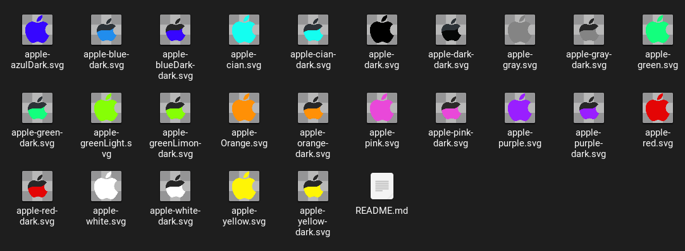

# Icon customization

- Free apple icons



=> All images are free, you might be worried about the quality, but they are all in `.svg`.

=> Each image is 50px wide and 50px high, in dual and single color scales.

=> Single colors will be named after `apple-color`.

=> Dual colors will have dark and adjacent color, for example: `apple-color-dark`.

> This will make a difference between one and the other.

## To Clone

=> Use in your Terminal:

```
git clone https://github.com/ErickNoGit/Custumizacion_icons.git
```
